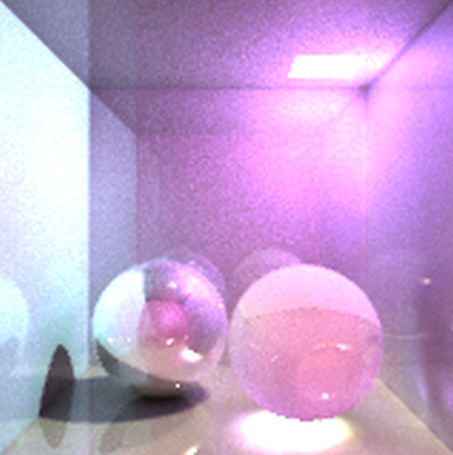

# PhysicallyBasedRendering-Distributed-Ray-tracing-Photon-mapping-

Naive C++ image synthesizer with distributed ray tracing and photon mapping

There are 5 stages of the system,

Binary intersection test/
Basic Ray tracing to synthesize Color image/
Accelerate Ray tracing with self implemented KD-tree/
Improve synthesis quality with distriubted ray tracing/
Another synthesize method (photon mapping)

